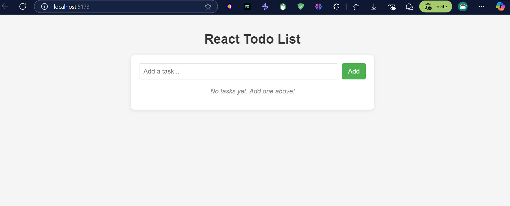

# 10-Days-Of-reactjs
Welcome to the 10 Days of React Practice project! 

This repository contains a series of challenges and projects designed to help you improve your React skills over 10 days.


## Table of Contents

| Day | Challenge/Project | Link |
| --- | ----------------- | ---- |
| 1   | Setting Up and Creating a Dashboard | [Day 1](#day-1-setting-up-and-creating-a-dashboard) |
| 2   | Build a to-do list where users can add, check off, and delete tasks. | [Day 2](#day-2-tbd) |
| 3   | Implement a timer for productivity cycles (25-min work, 5-min break). | [Day 3](#day-3-tbd) |


❤️ Happy coding ❤️
-------------------------------------

## Day 1: Setting Up and Creating a Dashboard

### Table of Contents
- [Features](#features)
- [Installation](#installation)
- [Usage](#Usage)


## Features
- Built with **Vite** for fast development.
- **Routing**: Implemented using `react-router-dom`.
- **Responsive Design**: The dashboard layout is responsive and adjusts to different screen sizes.
- **Styling**: Basic styling using CSS.

## Installation
1. Clone the repository:

   ````git clone https://github.com/DavisNoah02/10-Days-Of-reactjs.git````

2. Navigate to the project directory:

    ```cd Day1-Challange ```

3. Install dependencies:

    ```npm install```

   `` npm install react react-dom react-router-dom react``

4. Start the development server:

    ```npm start```

## Usage
Open your browser and navigate to ``http://localhost:3000`` to view the dashboard.


## Day 2: Build a to-do list where users can add, check off, and delete tasks.


# Acknowledgment
This challenge is provided by:
- Progskill: [Progskill.com](https://progskill.com)

# Contact
For questions or feedback, please reach out to:
- Email: m.davenoa@gmail.com
- GitHub: [_noa.dave_](https://github.com/DavisNoah02)
