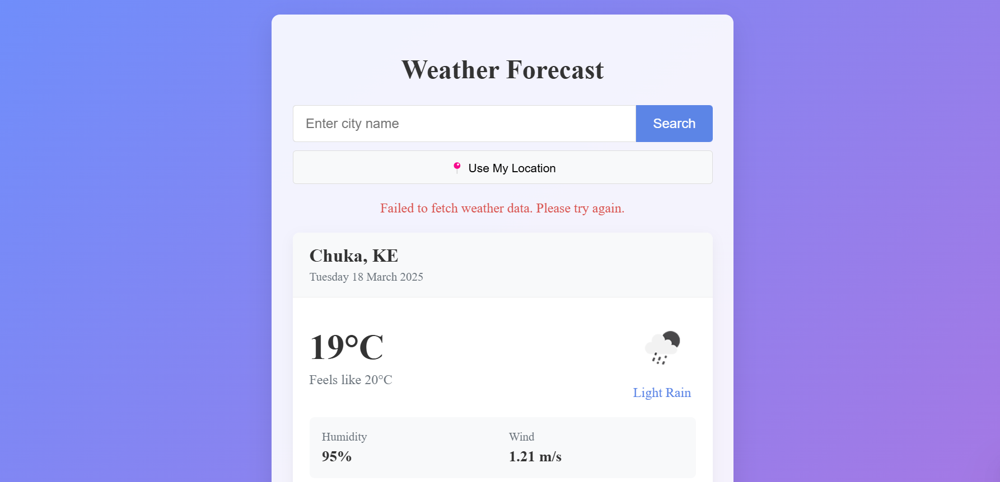

# 10-Days-Of-reactjs
Welcome to the 10 Days of React Practice project! 

This repository contains a series of challenges and projects designed to help you improve your React skills over 10 days.


## Table of Contents

| Day | Challenge/Project | Link |
| --- | ----------------- | ---- |
| 1   | Setting Up and Creating a Dashboard | [Day 1](#day-1-setting-up-and-creating-a-dashboard) |
| 2   | Build a to-do list where users can add, check off, and delete tasks. | [Day 2](#day-2-tbd) |
| 3   | Implement a timer for productivity cycles (25-min work, 5-min break). | [Day 3](#day-3-tbd) |


❤️ Happy coding ❤️
-------------------------------------

## Day 1: Setting Up and Creating a Dashboard

### Table of Contents
- [Features](#features)
- [Installation](#installation)
- [Usage](#usage)


## Features
- Built with **Vite** for fast development.
- **Routing**: Implemented using `react-router-dom`.
- **Responsive Design**: The dashboard layout is responsive and adjusts to different screen sizes.
- **Styling**: Basic styling using CSS.

## Installation
1. Clone the repository:

   ````git clone https://github.com/DavisNoah02/10-Days-Of-reactjs.git````

2. Navigate to the project directory:

    ```cd Day1-Dashboard ```

3. Install dependencies:

    ```npm install```

   `` npm install react react-dom react-router-dom react``

4. Start the development server:

    ```npm run dev```

##  Usage
Open your browser and navigate to ``http://localhost:3000`` to view the dashboard.

--------------------------------------------------------------------------

## Day 2: Build a to-do list where users can add, check off, and delete tasks.


### Table of Contents
- [Overview](#overview)
- [Techstack](#techstack)
- [TodoFeatures](#todofeatures)
- [TodoInstallation](#todoinstallation)
- [TodoUsage](#todoUsage)


## Overview
A simple, functional to-do list application built with React. This project demonstrates core React concepts like state management with useState, side effects with useEffect, and data persistence using localStorage. It’s designed to be lightweight, modular, and easily extensible for additional features.

## Techstack 
- React: Frontend library for building the UI.
- Vite: Build tool for fast development and optimized production builds.
- LocalStorage: Browser API for task persistence.
- CSS: Minimal styling (inline and optional global CSS).

## TodoFeatures
-  Add Tasks: Input and append new tasks to the list.
- Check Off Tasks: Toggle tasks as completed with a checkbox.
- Delete Tasks: Remove tasks individually.
- Persistence: Tasks are saved to localStorage and persist across page  refreshes.

## TodoInstallation
1. Clone the repository:

   ````git clone https://github.com/DavisNoah02/10-Days-Of-reactjs.git````

2. Navigate to the project directory:

    ```cd Day2-To-Do-List```

3. Install dependencies:

    ```npm install```

4. Start the development server:

    ```npm run  dev```

## TodoUsage
Open your browser and navigate to ``http://localhost:3000`` 

- Type a task in the input field and click "Add" (or press Enter).
- Check the box next to a task to mark it as completed (strikethrough applied).
- Click "Delete" to remove a task.
- Refresh the page—tasks persist via localStorage.

--------------------------------------------------------------------------


## Day 3: Implement a timer for productivity cycles (25-min work, 5-min break).
A simple and effective Pomodoro timer application built with React to help boost your productivity through timed work sessions and breaks.


- video
<video controls src="20250228-1544-40.2598278.mp4" title="Title"></video>

### Table of Contents
- [PomoFeatures](#pomofeatures)
- [PomoInstallation](#pomoinstallation)
- [PomoUsage](#pomoUsage)


## PomoFeatures
- 25-minute work sessions followed by 5-minute breaks
- Clean, intuitive user interface with visual mode indicators
- Start, pause, and reset functionality
- Automatic transition between work and break phases
- Audio notification when a session ends
- Tracks completed pomodoro cycles


## PomoInstallation
1. Clone the repository:

   ````git clone https://github.com/DavisNoah02/10-Days-Of-reactjs.git````

2. Navigate to the project directory:

    ```cd Day3-Pomo-Timer```

3. Install dependencies:

    ```npm install```

4. Start the development server:

    ```npm run  dev```


## Day 4: fetch real-time weather using an API (e.g., OpenWeather).
A modern, responsive React application that displays real-time weather information using the OpenWeather API.


Features

## OpenWeather Features
- Real-time Weather Data: Fetches current weather conditions from OpenWeather API
- Location-based Weather: Gets weather for the user's current location (with permission)
- Search Functionality: Look up weather in any city around the world
Responsive Design: Works seamlessly on desktop and mobile devices
- Detailed Weather Information: Shows temperature, feels-like temperature, humidity, wind speed, and conditions

## Setup Instructions
### Prerequisites

Node.js (v14.0.0 or later)

NPM or Yarn

OpenWeather API key 

## Installation

1. Clone the repository:

   ````git clone https://github.com/DavisNoah02/10-Days-Of-reactjs.git````

2. Install dependencies:
    ``npm install``

3. Create a configuration file:

    Copy ``config.example.js`` to ``config.js``
    Add your OpenWeather API key to ``config.js``


4. Start the development server:
``npm start``
or
``yarn start``

5. Open http://localhost:3000 in your browser.

How to Get an OpenWeather API Key

- Go to OpenWeather and sign up for a free account
- Navigate to the API keys section in your account
- Generate a new API key or use the default one provided
- Copy the API key to your config.js file

# Day5- Daily Quote

Welcome to the Daily Quote project! This React application fetches and displays a motivational quote each day. The quote is fetched from an external API and stored in localStorage to ensure that the same quote is displayed throughout the day.


## Table of Contents

- [Features](#features)
- [Installation](#installation)
- [Tech Stack](#tech-stack)
- [Components](#components)


## Features

- Fetches a new motivational quote from an external API.
- Stores the quote in localStorage to persist it across page reloads.
- Displays the quote and author.
- Provides a button to manually fetch a new quote.
- Handles loading states and errors gracefully.

## Installation

1. Clone the repository:

    ```bash
    git clone https://github.com/DavisNoah02/10-Days-Of-reactjs.git
    ```

2. Navigate to the project directory:

    ```bash
    cd Day5-DailyQuote
    ```

3. Install dependencies:

    ```bash
    npm install
    ```

4. Start the development server:

    ```bash
    npm run dev
    ```

## Tech Stack

- React: Frontend library for building the UI.
- Fetch API: For making HTTP requests to the quote API.
- LocalStorage: For persisting the daily quote.

## Components

### `DailyQuote`

The main component that handles fetching and displaying the daily quote.

- **State:**
  - `quote`: An object containing the quote content and author.
  - `lastUpdate`: A string representing the last update date.
  - `loading`: A boolean indicating the loading state.

- **Functions:**
  - `fetchQuote`: An asynchronous function that fetches a new quote from the API.
  - `handleReload`: A function that triggers a new quote fetch when the reload button is clicked.

- **Effects:**
  - `useEffect`: Checks if a new quote is needed on mount and updates localStorage when the quote changes.

## Acknowledgments

This project uses the [Quotable API](https://quotable.io/) for fetching motivational quotes.


<hr/>
<br>

# Acknowledgment
This challenge is provided by:
- Progskill: [Progskill.com](https://progskill.com)

# Contact
For questions or feedback, please reach out to:
- Email: m.davenoa@gmail.com
- GitHub: [_noa.dave_](https://github.com/DavisNoah02)


## Want To Contributing

Contributions are welcome! Please feel free to submit a Pull Request.

1. Fork the repository
2. Create your feature branch (`git checkout -b feature/amazing-feature`)
3. Commit your changes (`git commit -m 'Add some amazing feature'`)
4. Push to the branch (`git push origin feature/amazing-feature`)
5. Open a Pull Request


